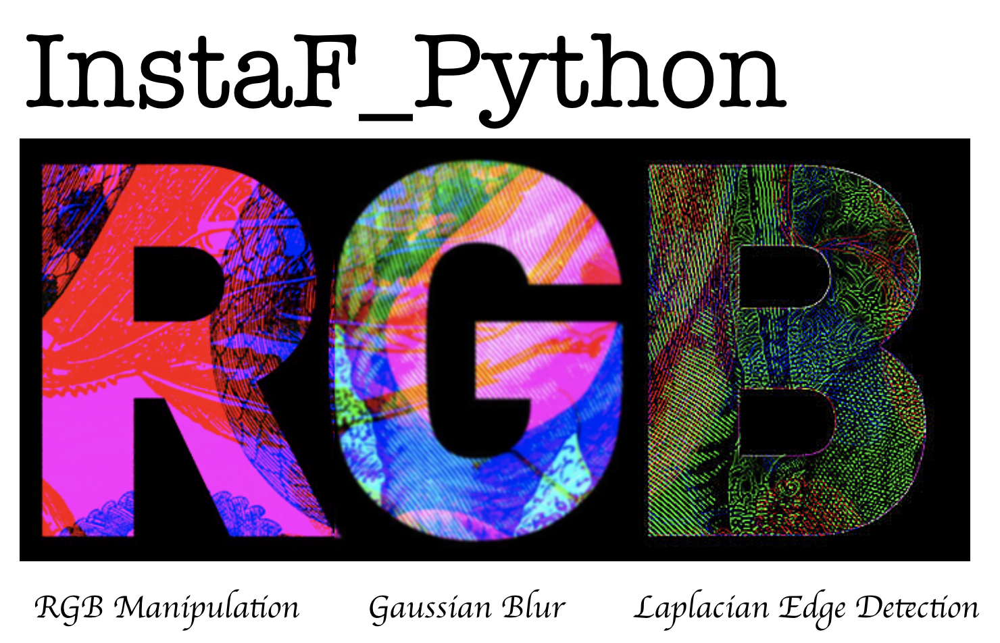

# InstaF in Python


## Contributors:

Betty Zhou     
Linyang Yu    
Reza Bagheri    
Simon Chiu    

## Overview

Image processing uses computer algorithms to enhance an image or to extract useful information from it. In this package, we have implemented some Python functions for image processing. These functions perform Gaussian blurring, Laplacian edge detection, and color changing.

## Functions

1. **Gaussian Blur**    
   This function performs convolution to de-emphasize differences in adjacent pixel values with a Gaussian distribution. The blurring effect removes detail and noise in the input image.
2. **Laplacian Edge Detecting**    
   This function performs convolution to emphasize differences in adjacent pixel values. The function detects edges by sharpening/highlighting the edges of an image.
3. **RBG Manipulation**    
   This function adjusts the red, blue and green intensity of an image by applying different weights for each RBG channel. This is similar to a colour filter in Instagram.


## Python Ecosystem

[InstaPy](https://github.com/UBC-MDS/InstaPy) is a Python package that contains the three functions: blur, flip and greyscale to transform images. In this project, we plan to implement three more image processing functions in Python by exploring additional filters.


## Repo structure:

InstaF_Python
  * [CONTRIBUTING.md](CONTRIBUTING.md)
  * [Code_of_CONDUCT.md](Code_of_CONDUCT.md)
  * [LICENSE.txt](LICENSE.txt)
  * README.md
  * InstaF_Python: folder contains all the Functions

    * gaussian_blur.py 
    * laplacian_edge_detecting.py 
    * RGB_manipulation.py 
    * \__init__.py
  * Testing Units Design: [test](InstaF_Python/test)
    * Contains images for testing: [test_image](InstaF_Python/test/test_image/)
    * testing units for Gaussian Blurring: [test_Gaussian_blurring.py](InstaF_Python/test/test_Gaussian_blurring.py)
    * testing units for Laplacian edge: [test_Laplacian_edge_detecting.py](InstaF_Python/test/test_Laplacian_edge_detecting.py)
    * testing units for RGB channel: [test_RGB_Manipulation.py](InstaF_Python/test/test_RGB_manipulation.py)

## Installation

Installing InstaF_Python is easy with only the following two steps:

1. Open your Terminal
2. Enter the following command: pip install git+https://github.com/UBC-MDS/InstaF_Python

## Usage

```import InstaF_Python```

#### 1. Gaussian Blur
```gaussian_blur(input_image_path, output_image_path, filter_shape = (3,3), sigma = 1)```

Arguments:

* ```input_image_path```: Path to the input image
* ```output_image_path```: Path to the output image
* ```filter_shape```: Size of the filter
* ```sigma```: Standard diviation of the gaussian distribution (higher sigma size allows stronger blurring)

Example:

```gaussian_blur("test/test_image/carnovsky_RGB_1.png", "test_py/test_image/test.png", filter_shape = (3,3), sigma = 1)```

Before:


After:


#### 2. RGB manipulation
```RGB_manipulation(input_path, output_path, R = 1.5, G = 1.5, B = 1.5)```

Arguments:

* ```input_path```: Path to the input image
* ```output_path```: Path to the output image
* ```R```: Adjusting intensity for red channel (integer, default: 2)
* ```B```: Adjusting intensity for blue channel (integer, default: 2)
* ```G```: Adjusting intensity for green channel (integer, default: 2)

Example:
```RGB_manipulation("InstaF_Python/test/test_image/test_img_RBG_input.png", "test/test_image/test_img_RBG_output.png", R = 1, G = 2, B = 3)```

Before:


After:


3.```laplacian_edge_detecting(input_image,  output_image)```

Arguments:

* ```input_path```: Path to the input image
* ```output_path```: Path to the output image

Example:

```laplacian_filter("test/test_image/test_img_laplacian_input.png", "test_py/test_image/laplacian_output.png")```

#### Package dependencies
|||
|---|---|
|numpy|             pandas|
|pytest|            os|
|skimage.io|        skimage.color|
|skimage.transform|

#### Package function testing

Test the function of RGB_manipulation: pytest InstaF_Python/test/test_RGB_Manipulation.py

Test the function of gaussian_blur: pytest InstaF_Python/test/test_Gaussian_blurring.py

Test the function of laplacian_edge_detecting: pytest InstaF_Python/test/test_Laplacian_edge_detecting.py

